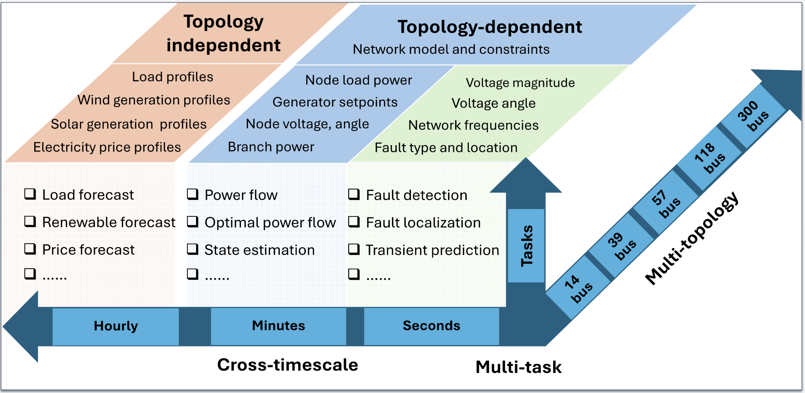
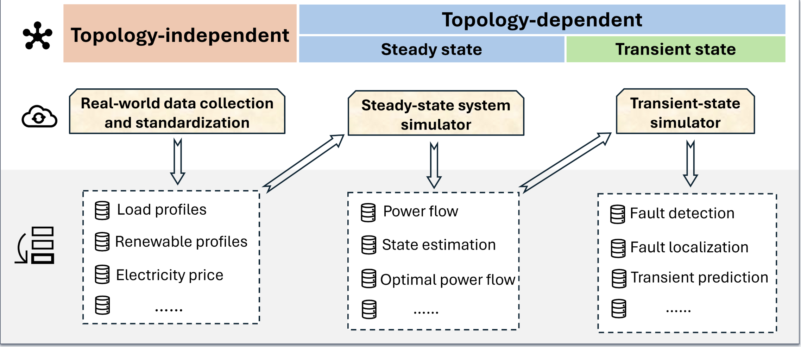

# PowerFM
PowerFM is an open-source repository for foundation models in the power and energy domain. It both maintains original projects and collects community-contributed open-source projects, featuring fine-tuned and domain-trained models for tasks like load forecasting, fault detection, grid simulation, and agent control.

## 🚀 Getting Started with PowerFM

### OpenPowerBench: Transformer-based Foundation Models

#### [Explore the Dataset and Benchmark for Power System Foundation Models Across Multiple Scales and Topologies](https://github.com/OpenPowerBench/OpenPowerBench)

**OpenPowerBench** is a first-of-its-kind open-source, multi-task, cross-temporal dataset designed to support training and evaluation of foundation models in power systems. OpenPowerBench includes both topology-dependent tasks (e.g., power flow, optimal power flow, contingency analysis) and topology-independent tasks (e.g., load forecasting, price prediction), supported by a modular data generation pipeline for scalable benchmarking across synthetic and real-world scenarios.

### GridFM: Graph Neural Network (GNN)-based Foundation Models

#### [Explore the Dataset and Graph for GridFM](https://github.com/gridfm)

**GridFM Community** The GridFM project pioneers the concept of FMs for the electric power grid to be trained on grid data – as opposed to text data – with the overarching goal to develop the underlying technology to cope with the increasing complexity and uncertainties of a faster growing grid (e.g., due to hyperscalar data centers, crypto mining etc.). More information about GridFM Community can be found [here](https://gridfm.org/)

### RAG-based Foundation Models

#### [Explore the Datacenter Siting Assistant: Solvtra](https://huggingface.co/spaces/zhangqianleo/datacenterAgent)

**Datacenter Siting Assistant: Solvtra** is a tool leverages RAG by incorporating datacenter-specific data, including local regulations, environmental reports, and infrastructure details. As a result, it can provide detailed information for potential datacenter locations, such as land and electricity prices, and generate a map illustrating existing datacenter sites and relevant infrastructure.

## 🤝 Contributing

We welcome contributions! Please see our [Contributing Guidelines](https://power-agent.github.io/) for details.

## 📄 License

This project is licensed under the MIT License - see the [LICENSE](LICENSE) file for details.

## 🙏 Acknowledgments

### Core Team
- [Shaohuai Liu](https://liushaohuai5.github.io/), [Alban Puech](https://www.alban-puech.fr/), [Qian Zhang](https://www.linkedin.com/in/qian-zhang-75323111b/) 

### Special Thanks
- All contributors who help make this project better
- [The Power and AI Initiative (PAI) at Harvard SEAS](https://pai.seas.harvard.edu/)
